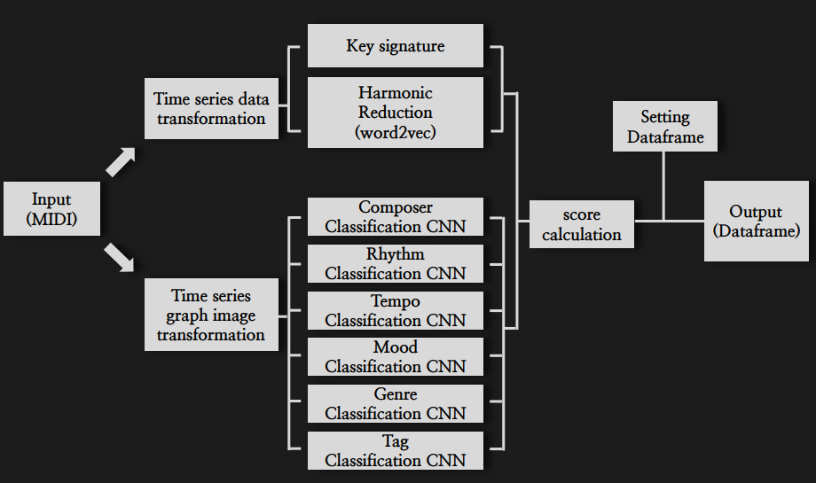
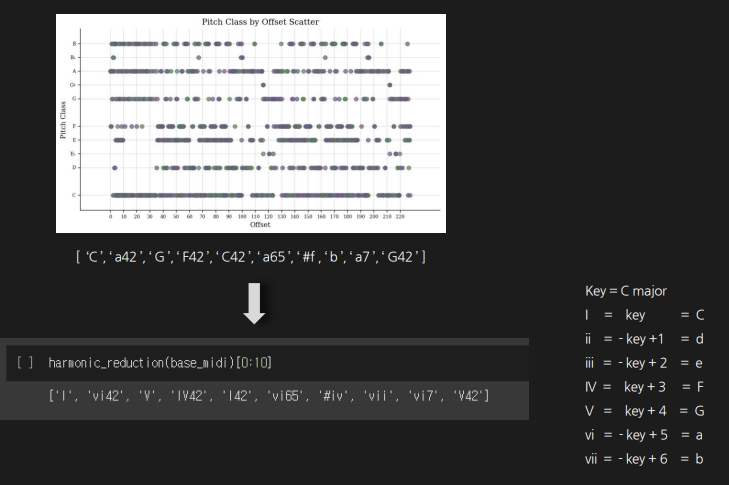
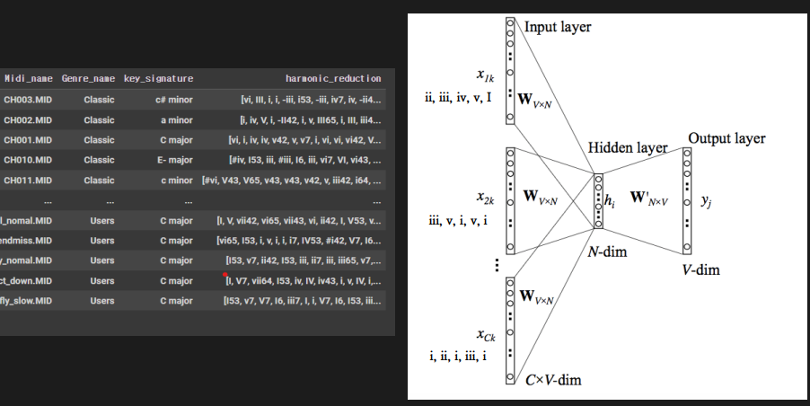
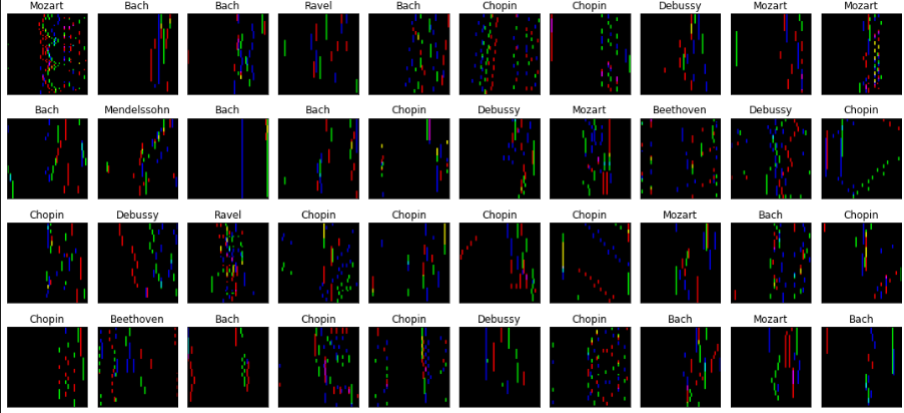

# ATOS MIDI
ATOS MIDI : Automatic tone optimizing system for digital piano using MIDI similarity analysis

## 1. Abstract
- This paper presents an automatic calibration system that determines the optimal sound settings for a musical piece by analyzing MIDI signals generated from digital piano performances using word2vec and graph CNN.
- Existing MIDI analysis often relies on harmonic analysis through the Music21 library or focuses on building harmonic progression classification models based on MIDI time-series graphs, resulting in limited applicability in business contexts and insufficient differentiation of the nuanced characteristics perceived by listeners.

- Therefore, we propose a new CNN classification model by combining the idea of ​​measuring harmonic progression similarity via word2vec and the concept of pixelating MIDI time series graphs. The model integrates multidimensional component weights into the analysis results to gain a deeper understanding of the user's playing style and generate customized sound settings that approach human-like adaptability.

## 2. Installation
- microsoft c++ build tools
- python-rtmidi
- pandas
- mido
- opencv-python
- numpy
- matplotlib
- seaborn
- tensorflow
- keras
- gensim # >= 4.0
- music21
- pickle5
- scikit-learn
- scipy
- tqdm
- ipython

## 3. Datasets
- MIDI data used in this training is not disclosed due to licensing issues. We have included a MIDI_recorder code that receives the user's performance directly as input in real time and uses it as data, and you can create your own dataset using this.

## 4. Structure

## 5. Model
### Step 1 : Key signature

### Step 2 : Harmonic Reduction(word2vec)

### Step 3 : MIDI to pixel image

### Step 4 : Classification CNN (ResNet152V2)
- [Composer,Rhythm,Tempo, Mood, Genre,Tag ... etc] 
### Step 5 : Score calculation

## 6. Result
- Chopin Fantasie Impromptu Op.66 
    - origin :
 

https://github.com/user-attachments/assets/5345f480-d0ca-460c-99b0-1c579f08fbb9

    - result :
    

https://github.com/user-attachments/assets/06567ccd-bd72-4371-b9d1-09d08549b588

  
- A.Ginastera Danzas Argentinas
    - origin :
 

https://github.com/user-attachments/assets/4fe8c52f-5849-481b-a18c-5dd904ccbe22

    - result : 

https://github.com/user-attachments/assets/b09b8c10-7c37-4ed3-8807-f2e09ea4dc97

  
- Debussy - Arabesque No.1 in E major
    - origin :
 

https://github.com/user-attachments/assets/2ee90c9f-5164-4f63-a10e-7481d7fe7bfb

    - result :

https://github.com/user-attachments/assets/5996252d-9be3-4744-8beb-832f32dcda7d

  
- Mozart: Piano Sonata
    - origin :
 

https://github.com/user-attachments/assets/b80cd7f9-d932-4382-a9a2-b8830d7f336e

    - result : 

https://github.com/user-attachments/assets/33158c8e-73de-4e3a-8c31-0c7eb2e52e9a

## 7. References

- https://towardsdatascience.com/midi-music-data-extraction-using-music21-and-word2vec-on-kaggle-cb383261cd4e
- https://github.com/narcode/MIDI_recorder
- https://github.com/asigalov61/MIDI-Tempo-Detective
- https://github.com/ori-2019-siit/AIMusicGenerator
- https://content.iospress.com/articles/semantic-web/sw210446
- https://ieeexplore.ieee.org/document/8457704
